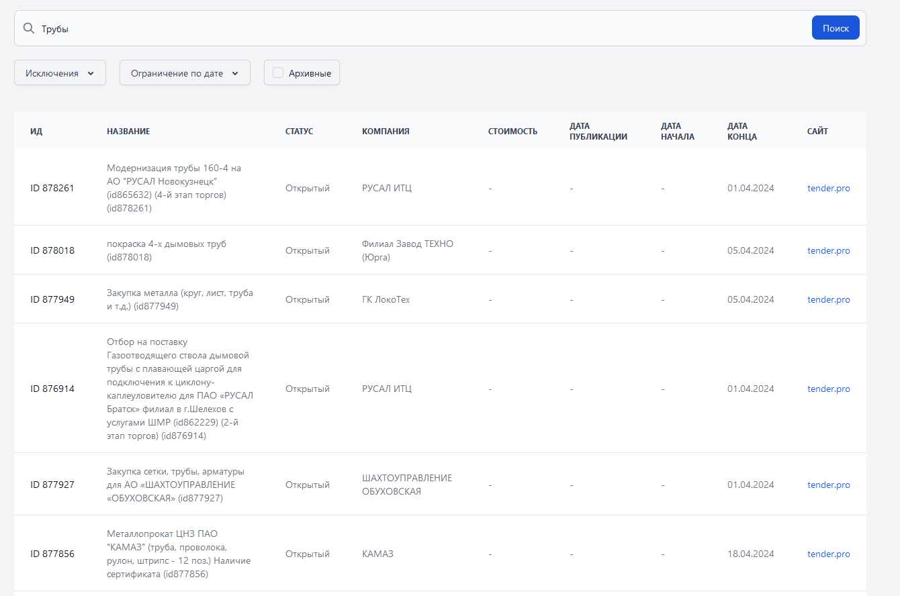

# Модуль происка тендеров

Проект представляет собой инструмент для поиска, фильтрации, 
отбора тендеров интернет-ресурсов [Tender.pro](tender.pro), [Фабрикант](etp-ets.ru), [TATNEFT](etp.tatneft.ru) с 
ссылкой на источник.

## Требования системы

### Переменные среды

- `GRPC_DATA_SERVICE_HOST` - хост дата сервиса
- `GRPC_DATA_SERVICE_PORT` - порт дата сервиса

### Зависимости

- SpringBoot
- Playwright
- Jsoup

## Запуск
